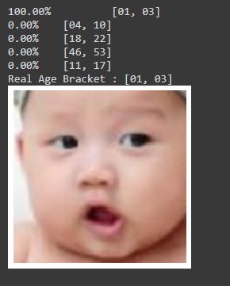

# CNN Deep Learning - Image Classification for Ages

In this project I will try to build a CNN Deep Learning model to predict ages for people using images. The image dataset is from [Kaggle](https://www.kaggle.com/jangedoo/utkface-new) and contains 23,000 images of cropped human faces of various ages, gender and ethnicity. The images also cover a large variation in pose, facial expression, illumination, occlusion, resolution, etc.

My approach for this project is to follow the OSEMN guidlines:
  1. Obtain the data
  2. Scrub the data
  3. Explore the data
  4. Model the data
  5. iNterpret the data

For the age bins, I decided on the following twelfth below. I chose these bins base so that I will have an equal amount of original images for each classes as well as the age ranges when people look the most similar.

(1-3) , (4-10) , (11-17) , (18-22) , (23-26) , (27-32) , (33-37) , (38-45) , (46-53) , (54-62) , (63-73) , (74-120)

### Distribrution of the Data

Looking at the distribrution of ages we can see that there are more images for the younger ages but have an equal amount for all the bins. Having an equal amount of data for each class is important for classification problems. If I needed more images for some of the classes, I could have use ImageDataGenerator from Keras to create agumented images. Before I started training the on the images, I also reshaped them into 224x224 size as well as scaled them by 1/255.

### The Baseline Model
First I will build a simple CNN Deep Learning model to see how it performs. Our baseline model contains 3 convolutional layers, two dense layers along with pooling layers. The model achieve a 50% accuracy on training data but only 35% accuracy on the test data.

We can see that our basline suffers from an overfitting problem which is also prevalent in all the other models that I tried training. Looking at the heat map we can see that the predictions for all the bin except for the highest and lowest ages aren't that accurate. The model especially struggles for the age bing in the middle.

## Transfer Learning
Since our model was trained only using the 11,200 images that we provided, it is not that sophisticated. To improve the predictions, I will make use of transfer learning.

Transfer Learning is a method in deep learning where pre-trained models are used as the base. All of the models that I will be using are trained on imagenet dataset which contains 14 million images and 1000 clasess. This is much bigger than our dataset.

Since early layers of images classification are use to detect simple details that are in all images such as edges, blobs of colors, and vague patterns, it can be transfer to our model.

The pre-trained models that I will be using are -
- VGG19
- VGG16
- ResNet50
- EfficientNet

Below is the table containing the performance scores of all our model

All of the models suffers from overfitting despite heavy regularization methods. The best accuracy on the test data is by the VGG16 model. This model also have the second lowest loss score, therefore it is by far the best out of all the models.

## Final Model

Our final model uses VGG16 as the base model with two dense layers on top of it, and uses softmax activation in the last layer. L1 regularization is used for the first dense layer, along with a dropout layer with a rate of 0.50. Out of the five block in the VGG16  base, the last block is left unfrozen and trainable.

An adam optimizer is used and the model is trained for 50 epochs.

Even though our model accuray only improve by 10% when compared to the baseline model, we can see by the heat map that it performs much better. Even for most of the predictions that the model got wrong, the range by which it got wrong is a lot less. Most of the incorrect predictions are only off by one or two bins. The model still struggles with predicting ages in the middle and excels at predicting ages of infants, teens and elders.

## The Predictor

Our final predictor intake either an array or an url link. If it is an array, it has to be already scaled by 1/255 and in the shape of (224, 224, 3). This is the format of our test images that has already been scaled.

For the url link, when a jpg or png link is provided to the predictor, the image will be downloaded, scaled and the predictions will be returned. A filename argument can be added to the function to save the image by a specific name and have it not be overwrited in the future.

Above we can see that our prediction was off by one bin.

The correct prediction for an infant got a certainess of 100%.

Our model correctly predicted the age of Sir Ian Mckellen.

Incorrectly predicted the age of Adam Driver.

Correctly predicted the age of Kevin Durant.

## Improvements

Our model performs very well on the test data but struggles a little bit with the faces of celebrities. This can be expected since celebrities generally look younger.

Improvements that can be made are -

  - Train on larger datasets
  - Change the sizes of age bins
  - Use higher resolution images
  - Try out other transfer learning models
  - Train Longer

